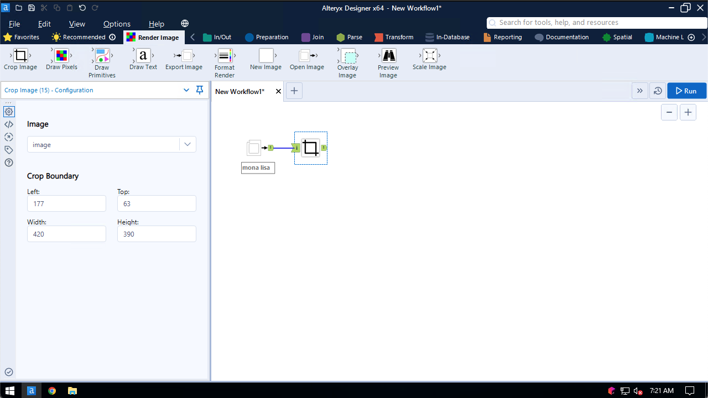
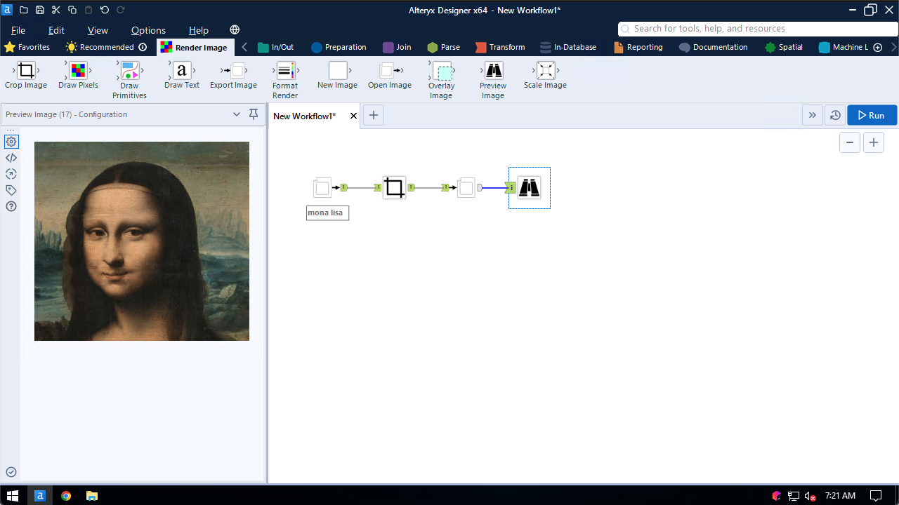

## Crop Image

Use the Crop Image tool to crop images.

The tool configuration screen looks like the following:

Specify the location to start cropping, as well as the dimensions of the final image.

This example crops an image of the Mona Lisa to her head:
