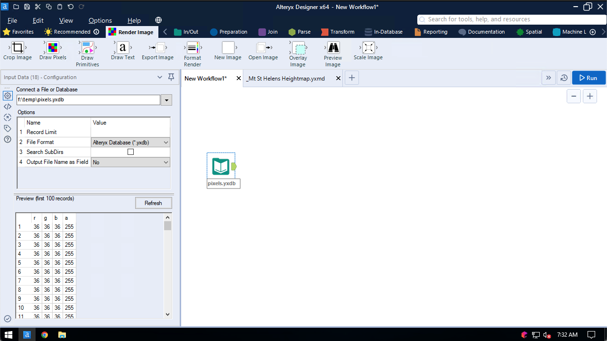
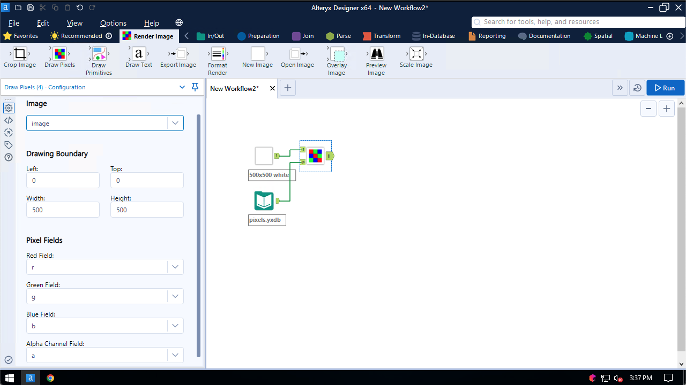
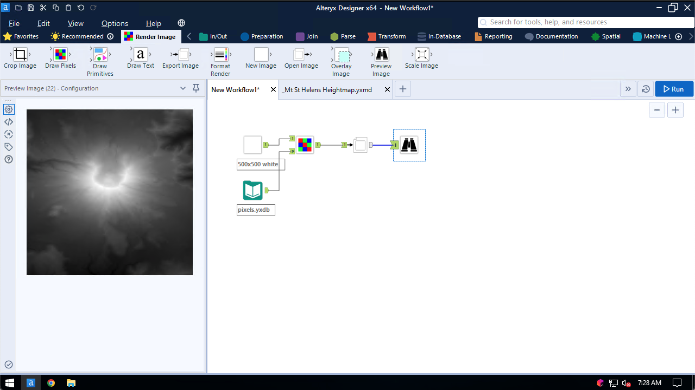

## Draw Pixels

Use the Draw Pixels tool to draw incoming data as pixels over a base image.

The incoming pixel data has fields for the Red, Green, Blue, and Alpha Channel values, as in the following screenshot. The values are provided as bytes, that is, whole numbers between 0 and 255

The tool configuration screen looks like the following:

Specify the location where to start drawing pixels, as well as the dimensions of the region where the pixels will be drawn. In this example the entire base image will be overwritten by the incoming pixels.

Pixels are drawn by row, starting at the top-left most pixel.

The final output of this example is a heightmap of Mount Saint Helens:

