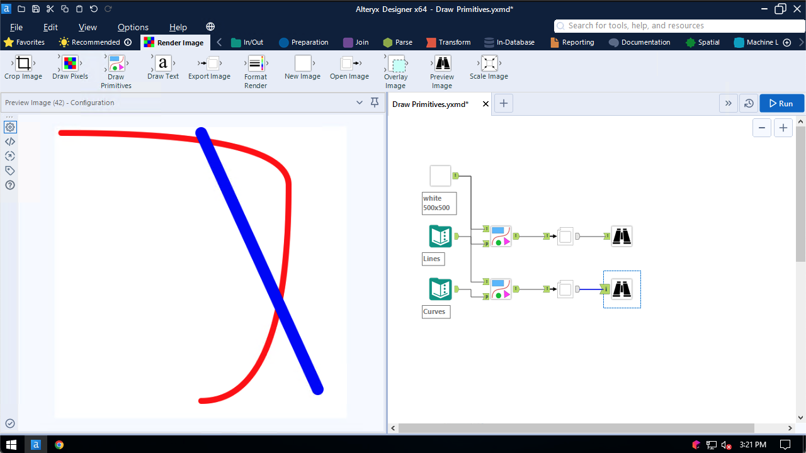

## Draw Primitives

Use the Draw Primitives tool to draw lines and shapes on a base image

### Path

Straight lines are drawn by specifying 2 points, as well as the desired formatting:

The tool configuration screen is separated into two sections. The first section deals with formatting of the primitive:

All of the formatting fields are optional. By default, outlines are not drawn and the shape is not filled. This means, to draw something, at least one formatting field must be provided.

The second section of the tool configuration screen defines the location and dimensions of the primitives. The settings for Paths looks like the following:

The group field, as well as the first and second points, must be provided. The third and fourth points are optional fields. This example draws straight lines and looks like the following:

Curves may be drawn by specifying lines with three or four points. Three-point lines create cubic Bézier curves and four-point lines create quadratic Bézier curves. This next example shows the input required for cubic Bézier curves:

The configuration screen and output of the cubic Bézier curves looks like the following. Note that the blue line is a straight line because it only has two of the three points filled in. This allows all three types of paths to be drawn from the same input stream.

Paths may also be filled. Records with the same group value are treated as belonging to the same shape:

To fill in the paths, provide a Fill Color:

### Circles

Circles are drawn by specifying the centerpoint and radius:

### Rectangles

Rectangles are drawn by specifying the top-left location, as well as the dimensions of the rectangle:

Corner Radius and Rotation are optional and both default to 0.

### Regular Polygons

Regular polygons are drawn by specifying the centerpoint, radius, and the number of sides:

Rotation is optional and defaults to 0.

### Arcs

Arcs are drawn by specifying the centerpoint, radius, start angle, and end angle:

