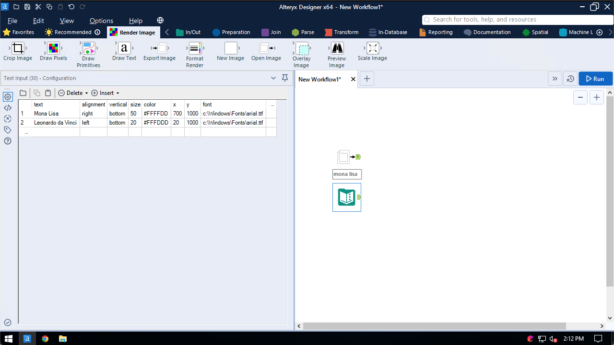
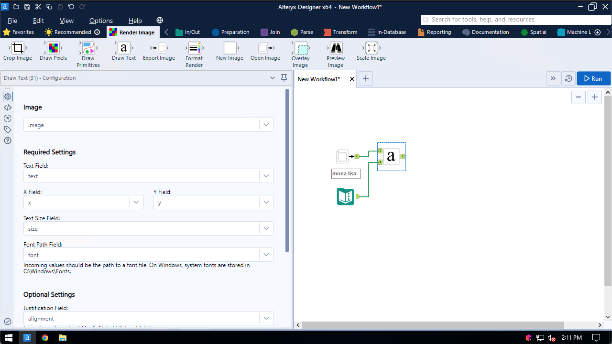
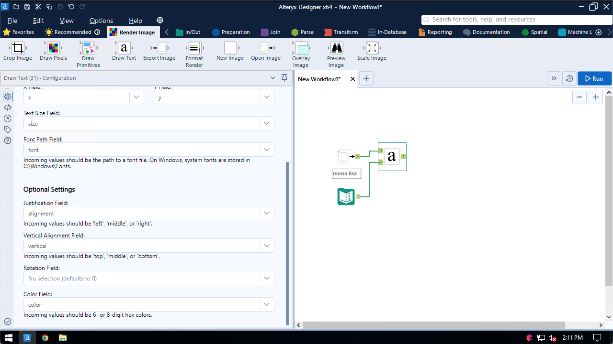
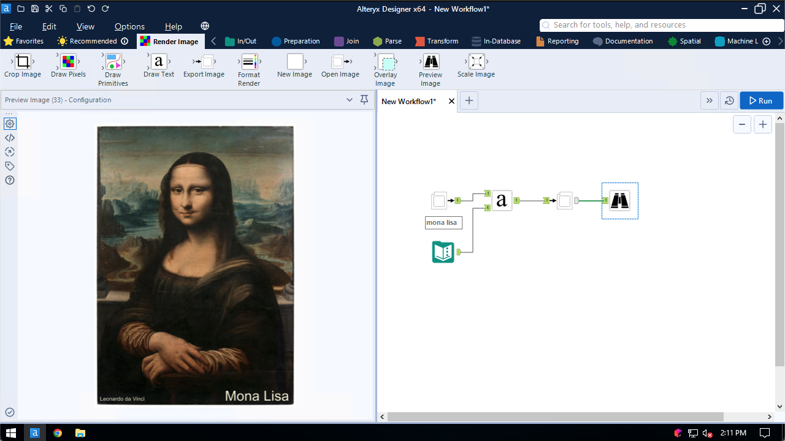

## Draw Text

Use the Draw Text tool to add text to a base image

Each text record is drawn onto the base image and can have its own positioning and formatting settings:

The tool configuration screen is divided into required and optional settings. The text field, location, size, and font are all required settings:

Justification, vertical alignment, rotation, and color fields are optional. If an optional field is not provided, a pre-defined default is used:

This example adds text information to an image of the Mona Lisa:
