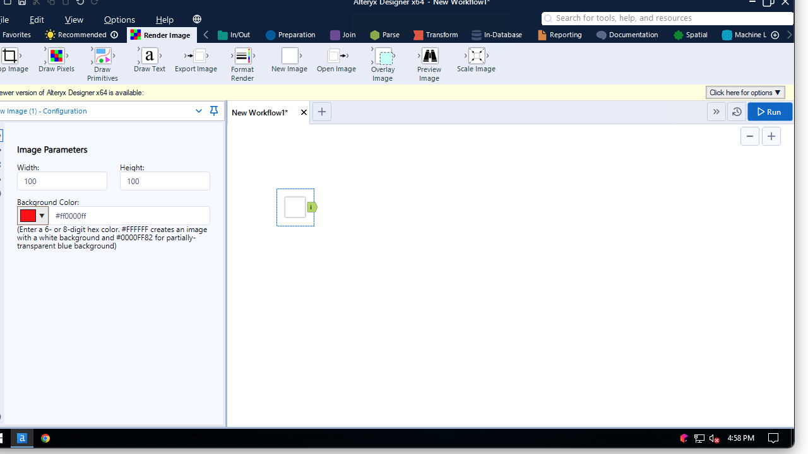
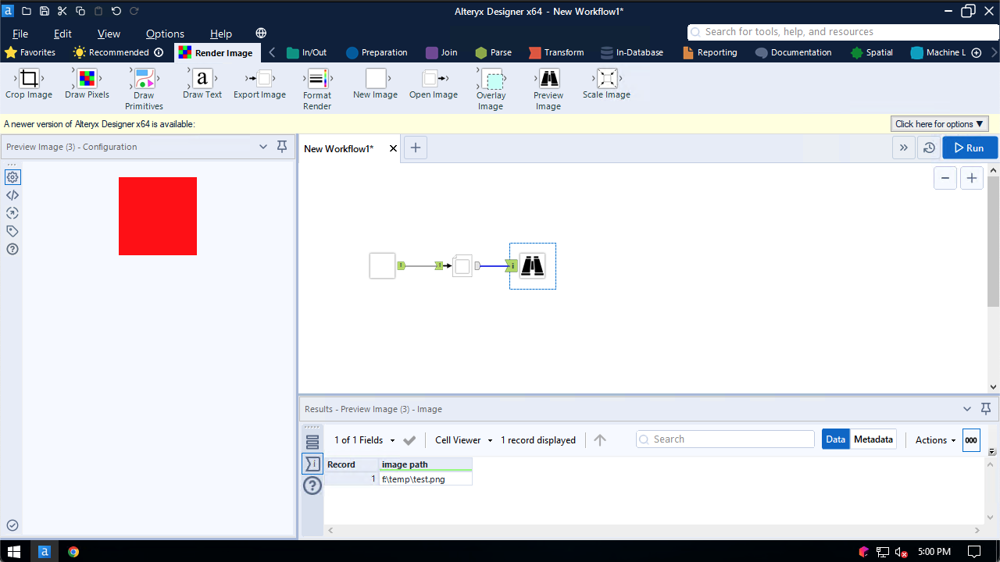
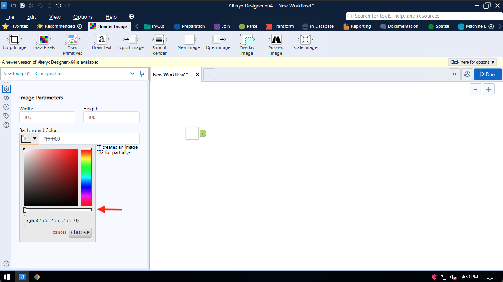

## New Image

Use the New Image tool to create a blank canvas.

You can specify the dimensions and background color of the canvas.

The background can include transparency. A fully transparent background makes a great starting point to build components which can be overlaid on top of other images.
