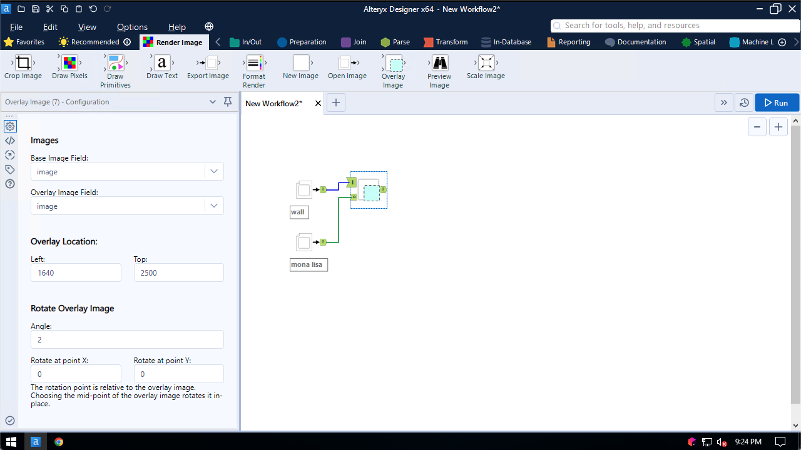
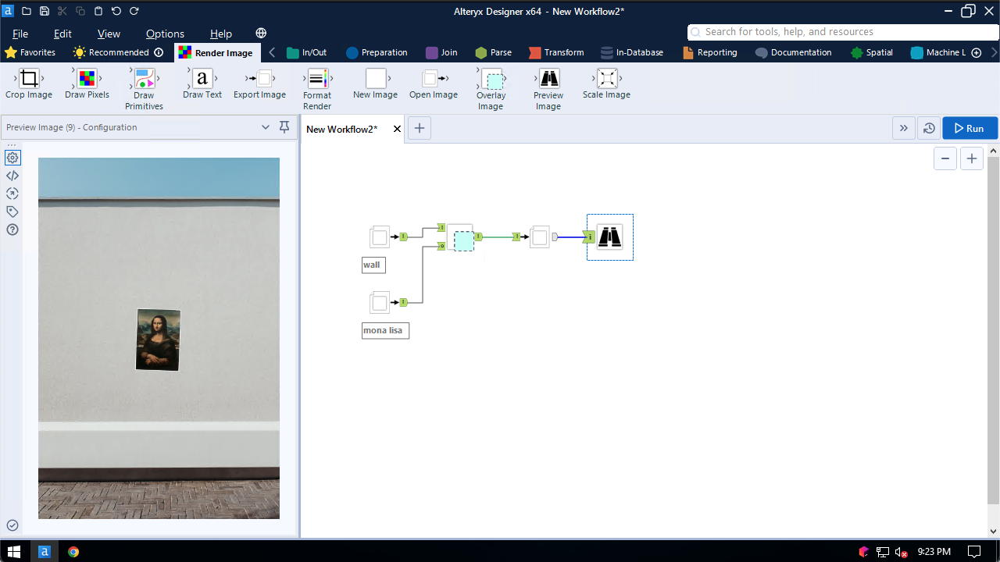

## Overlay Image

Use the Overlay Image tool to draw one image on top of another

Specify the location where the overlay image will be drawn on top of the base image:

You may also rotate the overlay image, specifying both the angle of rotation as well as the centerpoint of rotation.

