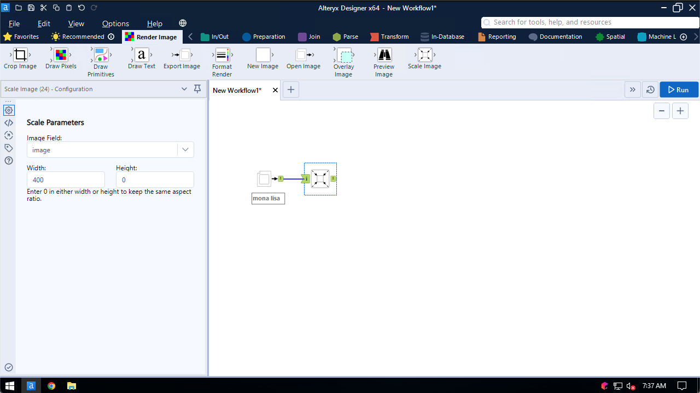
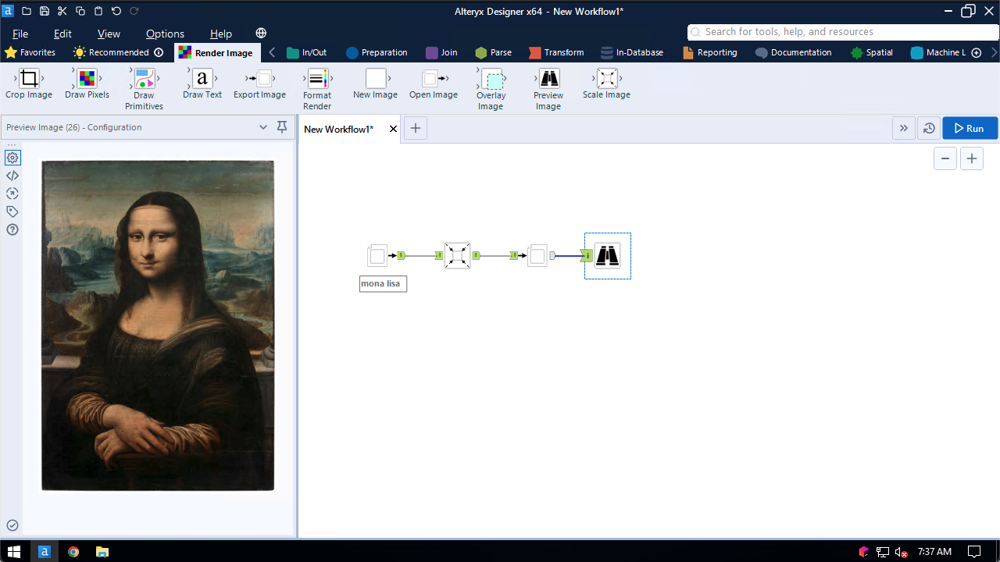
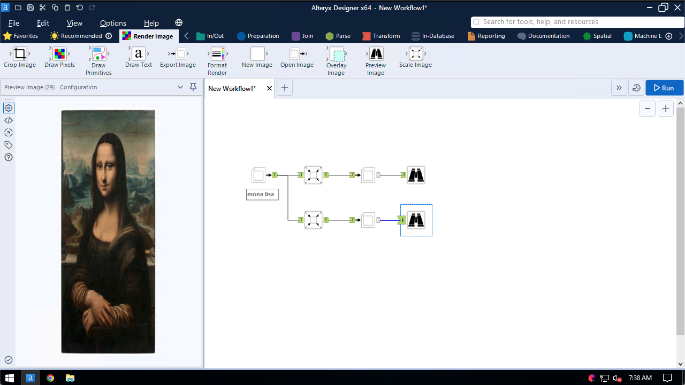

## Scale Image

Use the Scale Image tool to resize images

Specifying a width or height of 0 will resize the image and maintain the existing aspect ratio:

You may also specify both width and height and change the image's aspect ratio, causing it to distort:

